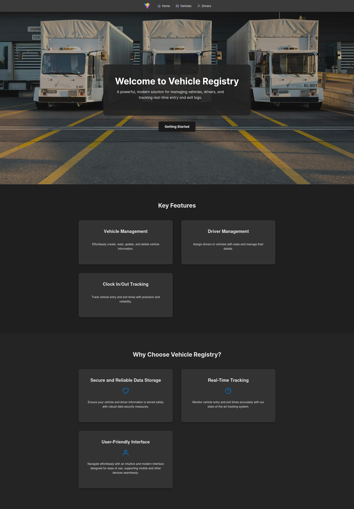

# Vehicle Registry Web

⚙ Production

Frontend client for a vehicle registration web app that allows entrance and
leave.

## Getting Started

Install project dependencies via `npm install`.

To completely integrate the application either in production or locally, you
will need to  
[set up the API server and database](https://github.com/tobiasbriones/vehicle-registry-api)
and ensure to set your [environment variables](#environment-variables)
accordingly.

Run development mode via `npm run dev`.

Run tests via `npm run test`.

Build for production via `npm run build`.

Run ESLint via `npx eslint .` or `npm run lint`.

## Environment Variables

The app utilizes environment variables to set production values.

Ensure *not to commit any environment variable* files (e.g., `.env`, `.dev.env`,
etc.) to the repository, even if they are for testing purposes, or they (still)
don't contain any sensitive information.

The environment file is `.env` and must be at the root of the project when
testing or deploying. You should also consider adding environment variables
directly into your deployment environment (e.g. Netlify, etc.) instead of using
a `.env` file.

### Setting Variables

The following variables work for production and development modes. Ensure to set
the proper values in a `.env` file (recommended for development) or directly
into your production environment.

| Variable            | Description                                          | Value               | Dev Value        |
|---------------------|------------------------------------------------------|---------------------|------------------|
| `VITE_API_HOSTNAME` | Hostname for the API server used by the application. | `${ api_hostname }` | `localhost:3000` |

## Production

The web app is deployed at
[Vehicle Registry \| Dev \| MathSoftware.Engineer](https://vehicle-registry.dev.mathsoftware.engineer)
via Netlify.

## Screenshots

Vehicle Registry is a modern web app with responsive styles for mobile, desktop,
and other devices.

### Landing Page

It presents the product with a landing page featuring a parallax background and
modern navigation bar with blur translucent background.

The CTA (Call to Action) section leads the user to the main feature of the
application.

It features a footer section with all the detailed links and information.

### Vehicle Logs

It provides a system to register robust vehicle logs with driver, event
(`entry` or `exit`), timestamp, and mileage. It facilitates a filter by vehicle,
driver, and date (day) to target specific logs.

**Vehicle Logs**

**Adding a New Log**

**Event Validation**

Events must be coherent, so if a vehicle is outside it'll need to enter and vice
versa. For example, a vehicle which last event was `entry` cannot enter again
until it logs `exit`.

**Mileage Validation**

Vehicle mileage is increasing or can be reset to zero.

**Filtering Logs by Date**

**Filtering Logs by Date and Driver**

**Filtering Logs by Date, Driver, and Vehicle**

### CRUD

It implements reliable CRUD (Create Read Update Delete) operations to define and
manage domain data.

**Vehicles CRUD**

**Adding a New Vehicle with Validation**

**Editing Vehicles**

**Robust Validation**

**Delete Confirm Dialog**

**Drivers CRUD**

**Adding a New Driver with Validation**

## Contact

Tobias Briones: [GitHub](https://github.com/tobiasbriones)
[LinkedIn](https://linkedin.com/in/tobiasbriones)

## About

**Vehicle Registry Web**

Vehicle registration web client application.

Copyright © 2024 Tobias Briones. All rights reserved.

### License

This project is licensed under the [MIT](LICENSE).
